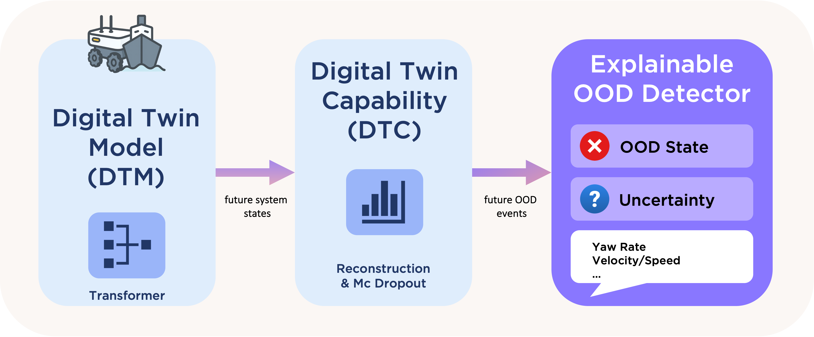

# Digital Twin-Based Out-Of-Distribution Detection

This repository implements a Transformer-based approach for proactive **out-of-distribution (OOD)** detection using **forecasting and reconstruction error analysis**. It is structured around a two-phase training process and supports confidence-aware inference and explainability.

---

🧩 **Conceptual Overview & Motivation**  
This framework integrates forecasting, uncertainty estimation, and feature-wise reconstruction analysis into a unified Digital Twin-based OOD detection pipeline:

- **Digital Twin Model (DTM)**: A Transformer that predicts and reconstructs future system states.  
- **Digital Twin Capability (DTC)**: Computes reconstruction error and MC-dropout-based forecast uncertainty.  
- **Explainable OOD Detector**: Flags OOD states using both anomaly scores and uncertainty, while attributing the cause to individual state features.

This capability aligns with the **Monitor** and **Analyze** phases of the **MAPLE-K feedback loop**, enabling not only detection but also explanation of anomalies. It lays the foundation for future integration with **planning and adaptation mechanisms** for self-adaptive systems.

> ⚠️ *This is an initial version of the tool, and further enhancements—especially for explainability—are planned in future work.*

---



> **Overview**: A Transformer-based Digital Twin (DTM) predicts future system states. The Digital Twin Capability (DTC) layer reconstructs forecasts and quantifies uncertainty. An explainable OOD Detector flags abnormal system behaviors based on reconstruction error, forecast variance, and feature contributions.

---

## 🚀 Setup

1. **Clone the Repository**

```bash
git clone https://github.com/ErblinIsaku/dt-ood-detection.git
cd dt-ood-detection
```

2. **Install Dependencies**

```bash
pip install -r requirements.txt
```

---

## ⚙️ Configuration

This project provides two use cases:

### 1. **Ship Motion Prediction** (NTNU dataset)
- Config file: `config/config_train.py`

### 2. **Trajectory Prediction using Mobile Robots** (PAL Robotics dataset)
- Config file: `config/mrobot_config_train.py`

> Datasets for both cases will be made available soon.

Modify the config files to set:
- `INPUT_FEATURES`, `OUTPUT_FEATURES`
- `DATA_PATHS`, `SEQUENCE_SETTINGS`, `TRAINING_PARAMS`

Also, update `config/config_inference.py` to set:
- `TEST_DATA_DIR`, `MODEL_PATH`, `SCALER_PATH`, etc.

---

## 🧠 Model Training

```bash
python main_train.py
```

Or for PAL-specific config:

```bash
python pal_main_train.py
```

This performs:
- **Phase 1**: Joint training for forecasting and reconstruction
- **Phase 2**: Fine-tuning the reconstruction head only
- Computes and saves reconstruction and uncertainty thresholds

---

## 🔍 Inference & OOD Detection

```bash
python main_inference.py
```

This performs:
- Forecasting on test data
- Computes forecast reconstruction error and MC-dropout variance
- Applies thresholds to detect OOD
- Generates visualizations and JSON-based diagnostics

---

## 📊 Outputs

- `forecast_results.csv`: Ground truth vs forecasted values
- `forecast_errors.csv`: MSE/RMSE per feature
- `thresholds.pkl`: Saved thresholds for inference
- `ood_diagnostics.json`: Confidence-aware OOD decision metadata
- Plots:
  - Forecasted vs GT curves
  - Reconstruction/variance distributions
  - Quadrant-based OOD scatter

---

## 📘 Notes

- Ensure that your **input and output features are defined clearly** and the combined feature set used for normalization does **not contain duplicates**.
- Inference will reuse the training-time normalization statistics.
- The script supports datasets with different feature combinations (e.g., Ship dynamics, Mobile robot navigation).
- This is an initial version of the approach/tool. Further implementation and optimization will be made available soon.

---
